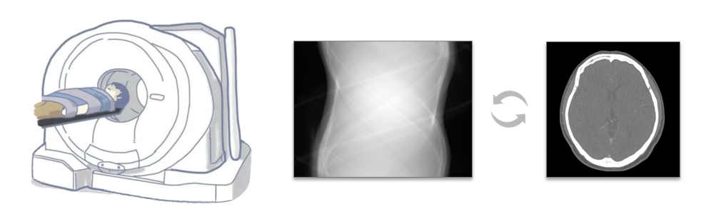

# torch-mando: Differentiable Domain Transform in PyTorch based on MandoCT

<p align="center">

</p>

This library introduces **Differentiable Forward Projection (FPJ) and Filtered Back Projection (FBP)** in [PyTorch](https://pytorch.org/) to enable dual-domain deep learning and optimization.

**Now support:**

- equidistant fan-beam
- geometric calibration

## Installation

- **Check the prerequisites**

  - torch-mando only works on Linux.
  - Prepare CUDA compiler nvcc, PyTorch, and GCC compiler.
  
- **Clone the repository**

  ```sh
  git clone git@github.com:CandleHouse/torch-mando.git --depth 1
  cd torch-mando
  ```

- **Install by running**

  ```
  python setup.py install
  ```

## About Geometry

Now support the following "parameter.jsonc" files to reduce the influence of geometry on the final results:

- **[PMatrixFile](https://github.com/CandleHouse/mandoct#how-to-set-pmatrix-)**
- SIDFile
- SDDFile
- ScanAngleFile
- DetectorOffcenterFile

**⚠️** It is advised to directly use **pMatrix** file instead of other files, since pMatrix along is able to describe all possible geometric deformations. You can even use torch-mando to reconstruct fan beam projections or project fan beam images with geometric vibrations, and the result is almost the same with [Mandoct](https://github.com/CandleHouse/mandoct).

```python
cfg = MandoFanBeamConfig(...)
# add params file
cfg.addPmatrixFile(readParamsFile('./params/pmatrix_file.jsonc'), pmatrixDetEltSize=0.4)
cfg.addSIDFile(readParamsFile('./params/sid_file.jsonc'))
cfg.addSDDFile(readParamsFile('./params/sdd_file.jsonc'))
cfg.addScanAngleFile(readParamsFile('./params/scan_angle.jsonc'))
cfg.addDetectorOffCenterFile(readParamsFile('./params/offcenter_file.jsonc'))
```

## Example

The main idea is to assemble a `Config` object which includes all necessary settings to perform FPJ and FBP, and pass it to `MandoFanbeamFpj` / `MandoFanbeamFbp` along with the image / sinogram.

```py
cfg = MandoFanBeamConfig(imgDim=imgDim, pixelSize=imgPixelSize, sid=750, sdd=1250, detEltCount=detEleCount,
                         detEltSize=detEleSize, views=views, reconKernelEnum=KERNEL_RAMP, reconKernelParam=1, fovCrop=False)
# In your network
# If you prefer nn.functional F style
def forward(self, x):
   x = MandoFanbeamFbp(x, cfg)

# If you prefer nn.Module layer style
def __init__(self) -> None:
   self.fbpLayer = MandoFanbeamFbpLayer(cfg)
def forward(self, x):
   x = self.fbpLayer(x)
```

View [example](./example) for code details.

## Declaration

This work highly depends on previous works by [ustcfdm/mangoct](https://github.com/ustcfdm/mangoct), [njjixu/mangoct](https://gitee.com/njjixu/mangoct), [SEU-CT-Recon/mandoct](https://github.com/SEU-CT-Recon/mandoct) and [matteo-ronchetti/torch-radon](https://github.com/matteo-ronchetti/torch-radon). This work draws lots of lessons from them. Thanks for their wonderful work.

## Cite this

Please use the following BibTex to cite this work, or click *Cite this repository* on the right.

```
@software{torch_mando,
  author = {SEU-CT-Recon},
  license = {MIT},
  title = {torch-mando: Differentiable Domain Transform in PyTorch based on MandoCT},
  url = {https://github.com/SEU-CT-Recon/torch-mando}
}
```

## License

MIT
